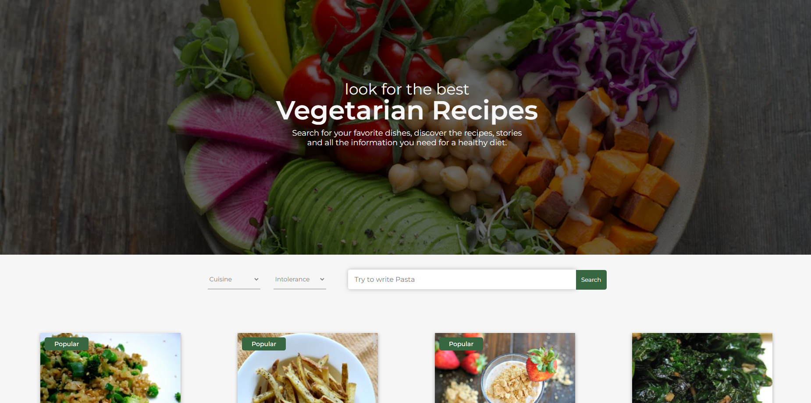

# React Project

## Description

In this project i used an API to get recipe data. Using the site you can:

- Search for different recipes using: name, intolerance and type of cuisine
- Open each recipe to find out more

## What i used to create it

- HTML
- CSS
- JAVASCRIPT
- REACT
- AXIOS

## About react

Inside this project code you can find:

- React Hooks
- React Router
- Context API

## Where to try it

 

To try this website follow the link below!

https://react-project.netlify.app/

Thanks for your attention! 